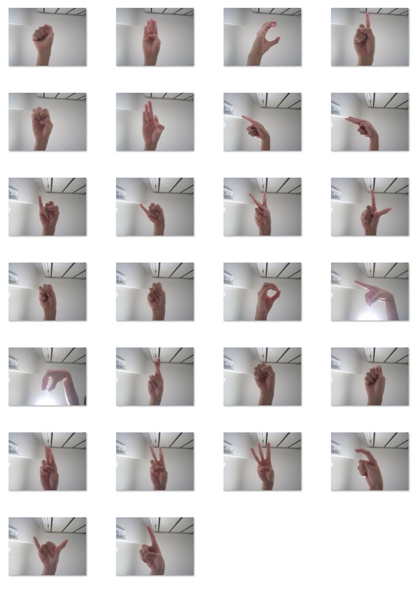
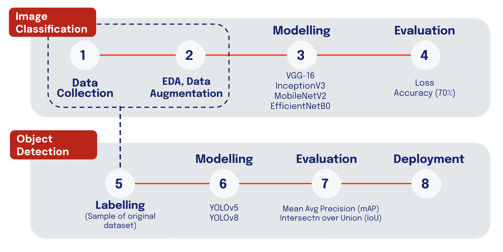
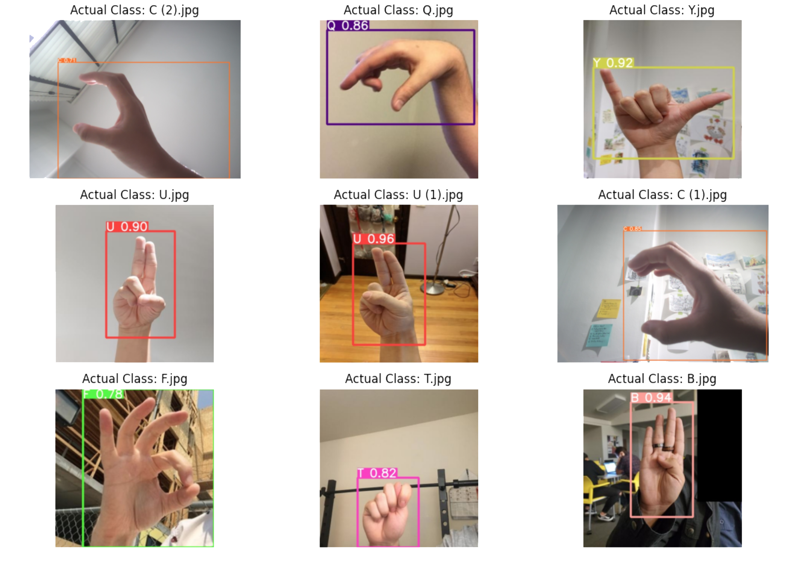

# Final Capstone Project:
## Singapore Sign (SgSL) Language Recognition through Computer Vision

---

## Contents

**[A. Executive Summary](#A.-Executive-Summary)**  
* [Context, Problem Statement](#Context)
* [Notebooks](#Notebooks)
* [Data, model files](#Data,-model-files)
* [Streamlit Application](#Streamlit-Application)

**[B. Scope of Work](#B.-Scope-of-Work)**  
* [Capstone Focus](#Capstone-Focus)
* [Future Development](#Future-Development)

**[C. Methodology, Metrics, Model Results](#C.-Methodology,-Metrics,-Model-Results)**  
* [Image Classification](#Image-Classification)
* [Object Detection](#Object-Detection)

**[D. Conclusion](#D.-Conclusion)**  

---

## A. Executive Summary

### Context
* In the rapidly evolving landscape of artificial intelligence, several pivotal factors are driving significant transformations in the field of media and communications. These factors include the [exponential growth of big data, remarkable advancements in computing power, and the convergence of AI with cutting-edge technologies](https://www.linkedin.com/pulse/rise-intelligent-machines-why-ai-exploding-2023-susan-lindeque/). This convergence has opened up new avenues for innovation and is poised to reshape the way we interact with media and communicate with each other.

* One notable milestone in this context is the development of revolutionary technologies, particularly voice-to-text captioning. These innovations have had a profound impact, particularly on the hard-of-hearing (HOH) community, offering them the ability to [experience videos and conversations on par with their hearing counterparts](https://www.forbes.com/sites/stevenaquino/2021/04/06/tiktok-makes-videos-more-inclusive-of-and-accessible-to-deaf-people-with-new-auto-captions-feature/?sh=3e8c08823345). However, there remains an opportunity to further advance the progress made by empowering the HOH community not just as consumers but also as creators in the digital realm. Vision-based sign language recognition is one such avenue for progress. It has the potential to create an all-encompassing digital environment, facilitating inclusive and interactive exchanges where HOH individuals can engage in meaningful two-way communication.

* In the specific context of Singapore, the recognition and importance of Singapore Sign Language (SgSL) have been growing steadily. However, compared to more established sign languages like American Sign Language (ASL), SgSL is relatively new and lacks tailored technological solutions and research support. This situation underscores the need to explore innovative ways to integrate AI and technology, addressing the unique needs of SgSL users. By providing them with tools that enable seamless communication and interaction in the digital age, we can contribute to a more inclusive and accessible society.

### Problem Statement 

* In light of the above context, *(as a hypothetical scenario)* you have been engaged by Instagram, who is keen to build upon their existing framework of real-time voice-based caption generation - through **the development of a new feature enabling automatic generation of text subtitles from live video signing**. This would contribute to many use-case scenarios within Social Media and Communication Technology such as instagram reels functions, real-time captions during video calls, etc.

* To address this challenge, your objective is to **explore a series of computer vision deep learning models that can perform recognition of Singapore Sign Language (SgSL).**

---

### Notebooks
* 01_Problem Statement, EDA
* 02_Image Classification
* 03_Object_Detection

### Data, model files

##### Notebooks 1, 2: Image Classification
The image data and h5 files of model callbacks are located in google drive.

Train and Test datasets can be found here:
https://drive.google.com/drive/folders/1fVbzx_ZLPwFtKJYJc22Wl5eelGiWOjLK?usp=sharing 
Model checkpoints can be found here:
https://drive.google.com/drive/folders/1qVgdRHrTuQDFrux3XsCFJjgvmZfQ4JE2?usp=sharing

##### Notebook 3: Object Detection
For object detection, model training was done on google colab.
Code notebook, datasets, model training output can all be found here:
https://drive.google.com/drive/folders/1pQqbXz7YyCw_w2wKQTDcfD5YsCAcWayO?usp=sharing

### Streamlit Application
Access the streamlit app here:
https://sgsl-recognition.streamlit.app/

---

## B. Scope of Work

This project will unfold in a multi-part structure. 
For this capstone, the focus is on carrying out Part 1 of the project as a proof-of-concept (POC) for the rest of the project:  

### Capstone Focus
`Part 1: Alphabet Classification`
* Carry out data augmentation to build upon existing sign language image datasets available on kaggle.
* To experiment with several deep learning methods for sign recognition at the alphabet level
    * Develop an image classification model that classify the 26 SGSL signs for letters in the alphabet. Pre-trained transfer learning models such as VGG-16, InceptionV3, MobileNetV2, EfficientNetB0 were used.
    * Develop an object detection model that can accurately perform object localisation and classification on both images and videos. We experimented with single-shot learning models such as YOLO.

### Future Development
`Part 2: Words Detection`
* Build a dataset of SGSL videos (since there are little resources for webscraping)
* Develop a object detection model that can enable the identification of single words through real-time video signing.

`Part 3: Phrases, Sentences Detection`
* To study the unique linguistic structure of SgSL
* To explore transforming sequences of SgSL gestures into coherent textual phrases and sentences.
* Sequence-to-Sequence Models (Seq2Seq), NLP 

---
## C. Methodology, Metrics, Model Results

We experimented with 2 approaches for alphabet recognition:
1. Image Classification
2. Object Detection

### Image Classification

##### Summary
* For Image Classification, using a dataset of 11700 train images, and 3120 test images, we carried out data augmentation via the imagedatagenerator to artifically expand our dataset during the model training process. Our top model, EfficientNetB0, has a training accuracy of 0.9612 and an cross-entropy loss of 0.1263, and a testing accuracy of 0.9314 and testing cross-entropy loss of 0.2434. It has the lowest loss amongst the models, and it has a reasonable average training time per epoch of around 500seconds. The problem statement highlighted the need for the model to fulfill the industry standard of 70% accuracy rate in order to be deemed successful. Our model has proven to surpass this, being able to accurately classify images to a commendable accuracy level.

##### Metrics used
* Accuracy (industry standard of 70% accuracy rate is used because for sign language translation, users have the flexibility to clarify or seek additional context in case of misinterpretation)
* Cross-Entropy Loss

##### Model Results
|Model No|Model Used|Characteristics|Loss|Accuracy|Conclusion|
|--|--|--|--|--|--|
|1|VGG-16|• Deep convolutional neural network (CNN) model supporting 16 layers. • Utilizes smaller 3x3 convolutional filters, reduces tendency for overfitting| 0.4052 (Train)  0.4675 (Test)|0.8761 (Train)  0.8718 (Test)|Good fit|
|2|InceptionV3|• Uses multiple filters of different sizes in parallel to capture features at different scales • Has low computational demands compared to other architectures|0.4607 (Train) 0.4606 (Test)|0.8483 (Train)  0.8597 (Test)|Slight underfitting|
|3|MobileNetV2|• Uses Depthwise Separable Convolution which reduces complexity of model. • Adopts an inverted residual structure • Well balanced between model size, computational efficiency, and accuracy|0.2327 (Train)  0.2874 (Test)|0.9280 (Train)  0.9141 (Test)|Slight overfitting|
|4|**EfficientNetB0**|• Achieves state-of-the-art accuracy with fewer parameters (computationally efficient) • Provides a good balance between model size and performance.|0.1263 (Train)  0.2434 (Test)|**0.9612 (Train)  0.9314 (Test)**|Very slight overfitting  Best score|

  

### Object Detection

##### Summary
* For Object Detection, we extracted a smaller sample dataset to do hand labelling on the Roboflow platform - 630 train images, and 52 test images (post-data augmentation). For this phase of the project, we mainly experimented with Single-Shot Learning models, namely the YOLO (You Only Look Once) algorithm. Between YOLOv5 and YOLOv8, YOLOv8s (we used the small version of the model) was more successful. The metrics of Mean Average Precision (mAP), Precision and Recall were used to assess model performance; YOLOv8s had very similar train and test scores for all metrics, indicating a well-balanced model. The model has a testing precision score of 0.896, recall score of 0.656, and mAP at IoU 50% was 0.848. When reviewing the inferences of the YOLOv8s model, the model performed consistently well in predicting both images and videos, with majority of the prediction probabilities being above 70%.

##### Metrics used
* Mean Average Precision (mAP): Summarises the precision and recall of the detected objects across different confidence thresholds and provides a single value that quantifies overall detection performance
* Precision and Recall: Precision measures the accuracy of object detection by calculating the ratio of true positives to the total number of predicted positives (true positives plus false positives). Recall measures the model's ability to detect all instances of a given object class by calculating the ratio of true positives to the total number of ground truth positives (true positives plus false negatives).

##### Model Results
|Model No|Model Used|Precision|Recall|mAP50 mAP at IoU 50%|mAP50-95 mAP at IoU 50-95%|
|--|--|--|--|--|--|
|1|YOLOv5s|0.248 (Train) 0.333 (Test)|0.462 (Train)  0.314 (Test)|0.367 (Train)  0.274 (Test)|0.232 (Train)  0.150 (Test)|
|2|**YOLOv8s**|0.896 (Train) 0.896 (Test)|0.655 (Train)  0.656 (Test)|0.848 (Train)  0.848 (Test)|0.673 (Train)  0.673 (Test)|

 

##### Model Inference Examples

With images: 

* We can see that the model was able to perform object detection on our images, and classify the alphabets effectively.
* Within this small sample alone, we can see that all alphabets were accurately classified with above 0.7 probability.

 

With videos: 

* As an example, the above is the output of running our object detector on a video, with handsigns for letters "A, B, C, F".
* We can see that accuracy is high for each of the alphabets. On average, probability predicted for each of the signs are around 85%.
* We also note that the probabilities generally improve when we move our hand closer to the camera, as compared to being further away.

---
## E. Conclusion

### Limitations and Recommendations
In the pursuit of advancing accessibility and inclusivity, this project has taken steps towards bridging the communication gap for the Hard of Hearing (HoH) community. This capstone project succeeded in being a proof-of-concept (POC) to show us the potential that computer vision in sign language recognition could bring.  

For further improvements and development downstream, we would like to point out several potential limitations of the model as well as some recommendations:

**1) Data Availability **
* For this capstone, we deemed the ASL dataset suitable for use in SgSL Alphabet Classification since SgSL was based off ASL fingerspelling, and is largely the same. However, there could be some slight nuances in local handsigning that may not have been captured. An example would be the letter 'T', where SgSl has an alternative modified version. 
* Moving into the next stage of the project of signing words and phrases, one of the primary limitations would be the availability of diverse and extensive sign language datasets, especially for less common sign languages like Singapore Sign Language (SgSL). 
* We would have to look into collaborating with sign language communities and organizations to collect and curate a more comprehensive dataset, ensuring representation of different signing styles, accents, and local variations. As of now, emails have been sent to the Singapore Association for the Deaf and NTU's SgSL Signbank on the request for data and possible collaborations.

**2) Computational Power, Time Constraints **
* The constraints of computational power and time were the main limitations of model experimentation. For future development, with more time, other versions of the YOLOv8 models (e.g. YOLOv8m, YOLOv8l, YOLOv8x) should be tested to compare the computational time required for the various models and the tradeoff with model metrics scores. Model optimization techniques should be further explored to reduce computational requirements while maintaining accuracy.

**3) Ambiguity and Context  **
* Planning ahead to the next stage of the project, we will realise Sign language relies on contextual cues and facial expressions, introducing ambiguity. Recognizing nuanced meanings and emotional expressions can be challenging, and the unique linguistic structure of SgSL will have to be considered as well.
*  We will have to look into investigating methods to incorporate context and facial expression analysis into the recognition process. Develop models that can capture and interpret the subtleties of sign language communication.

In conclusion, the initial phase of our sign language recognition project has laid a solid foundation, demonstrating the potential of technology to bridge communication barriers for the Hard of Hearing (HoH) community. As we look ahead to the next stages, there is immense potential in creating meaning in every gesture, word, and phrase. By extending our focus from letter classification to word and phrase recognition, we are poised to create a comprehensive solution that empowers HoH individuals to communicate with ease and confidence in the digital age. 